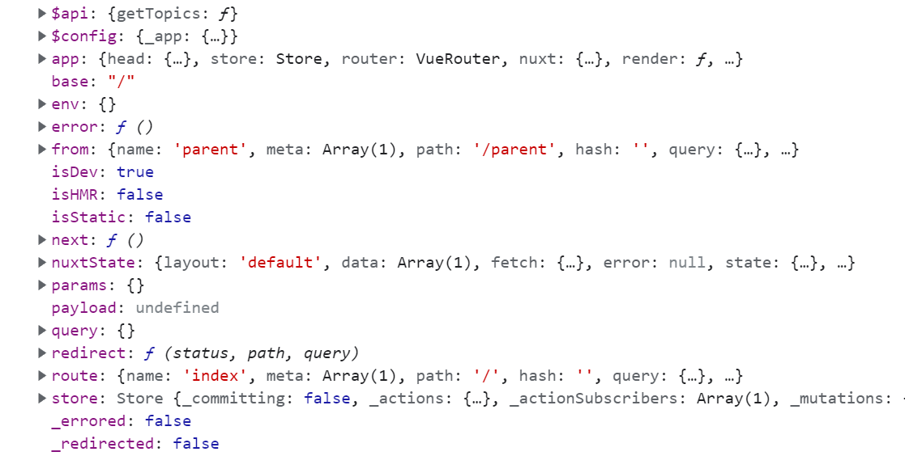

## 1.Loading

### 1.目标

​     我们在开发网站，出现接口在指定时间内没有返回数据，此时页面时空白的，为了提升用户体验，给loading加载提示

### 2.实现思路

1.    ```在components/LoadingBar.vue``` ， 定义开始加载，结束加载两个方法， 给外部使用
2.    nuxt.config.js 配置loading
3.    在页面中使用


### 3.总结

1. 在页面中使用 ``` this.$nuxtTick``` 在回调里面使用loading组件中提供的start  finish


## 2.Head配置

### 1.目标

 我们在开发网站，为了提升SEO优化，除了SSR， 还可以设置网页TDK,   

​		T： title   D：description  K：keywords


### 2.实现思路

1. nuxt.config.js  配置head
2. 页面中配置head


### 3.总结

1. TDK的配置，需要在全局nuxt.config.js中或者页面中head() 方法配置
2. hid属性用于页面中头部配置覆盖全局头部配置


## 1.Fetch

### 1.目标

​	 开发中会经常调用接口，返回的数据需要公共使用，需要把数据存到vuex上，可以在fetch中完成


#### 2.实现思路

1. store/index.js 定义state  mutations 
2. plugins/axios.js 完成axios封装
3. 在组件中使用fetch 把接口返回的数据填充到vuex中
4. 页面中使用vuex提供数据，渲染页面


### 3.总结

1. 把接口返回的数据填充到vuex中， 可以在fetch中完成， 可以完成服务端渲染
2. fetch可以使用在任意组件，而 asyncData 只能使用在页面组件
3. 如果只是客户端渲染， 在mounted 中


## 4.Fetch 和asyncData区别

####      1.目标

​               数据分vuex中公共数据还有页面中的数据， 对于接口返回的数据处理，存放到vuex中就使用fetch， 否则就是asyncData


####     2.实现思路：

                1. 页面中同时使用 fetch， asyncData


####     3.总结

                1. asyncData中返回的数据，页面可以直接使用
                2. fetch 只能在data上先声明变量， 在fetch中完成data上数据的修改，  最适合做掉接口，拿数据，存vuex
                3. fetch可以在服用组件使用， asyncData只能用页面组件
                4. 都可以做服务端渲染
                5. 不需要服务端渲染， mounted


## 5.生命周期钩子

1. 运行在服务端, 客户端

     beforeCreate， created  asyncData ,fetch  中间件

2. 只能运行在客户端

   1. vue2提供的生命周期除beforeCreate created之外，都是运行在客户端

3. 开发中那哪些生命周期钩子

   1. 如果需要做服务端渲染，就不要使用mounted等只能运行客户端的钩子‘
   2. 如果需要做客户端渲染，就不要使用asyncData等可以运行服务端的钩子


## 6.Fetch

1. 在fetch中要么使用this读取store  或者插件等等      要么是通过fetch函数中第一个参数解构之后  
2. this 和是否使用fetch函数中参数是互斥， 二者选其一
3. fetch中第一个参数：
   1. 


​     根据自己需要，进行结构


## 7. 列表页详情页

#### 1.目标

​     完成列表页渲染，并且跳转到详情调用详情页接口，拿到数据渲染详情页

#### 2.实现思路

1. 在page目录创建两个页面
2. 点击列表每一项需要传递参数到详情页
3. 详情页接收列表传递的参数
4. 在详情页拿到参数，请求详情页接口
5. 拿到数据渲染页面


#### 3.总结

1. 接口返回的数据是html，我们需要使用v-html解析
2. asyncData 或者fetch中第一个参数解构出 params.参数名      query.参数名  


## 8.项目部署

### 1.nginx

#### 1.目标

​        我们开发过程，项目开发完毕，会留到下一个测试环节， 测试完毕并且bug修复完毕，下一个环节是项目部署上线。

####   nginx

​         高效轻量的web的服务器


#### 2.实现思路

1. 下载nginx   http://nginx.org/en/download.html

2.  解压到你电脑(服务器)上指定目录 

3.  配置nginx 

   1. nigix -t  校验nginx配置是否正确

   2. 。

   3. 启动nginx  (切换到nginx根目录)

      1. nginx -c  conf/nginx.conf

      2. 访问网站(默认)
      3. 

      

      


####  3.总结

1. 下载nginx解压后启动nginx  
   1. 切到nginx根目录   nginx -c conf/nginx.conf
   2. 地址栏：localhost:80
   3. nginx -t  校验配置是否正确


### 2.项目部署打包

####  1.目标

​			项目开发完毕，打包部署上线

#### 2.实现思路

```javascript
开发时：

          yarn dev    开启本地服务  运行你的项目

开发完：

	    1. 静态部署
          
        	网站静态化：
            	
               将网站所有页面，调用接口，动态交互等，全部在服务端给你最终渲染成了html静态页面，相当于整个网站所有页面全部时静态的html css
               
               优势：访问速度非常块
               缺点：股票网站 （不能做静态化）
               
               解决方案：
               
               对于数据不频繁发生变化, 我们也可以做静态化， 我们定时每天定时凌晨2点开始重新再生成一次静态页面，那么这个生成的静态网站就是最新的
               
               
               
           2.执行打包命令
             
             yarn generate
                    
        
        
        2. 动态部署
             
             本质上开启一个node服务器， 帮你的网站通过node启动你项目
             
             优势： 数据可以实时更新

             缺点： 访问速度变满，是因为每个页面都是动态渲染，动态调用接口，拿到数据再去渲染。
             
             	
```


#### 总结：

1.    静态部署 yarn generate  ， 网站静态化， 优势时访问快，缺点：数据不能实时跟新
2.    解决网站静态化数据更新问题， 定时yarn generate 重新拿到最新数据 重新 静态化即可


