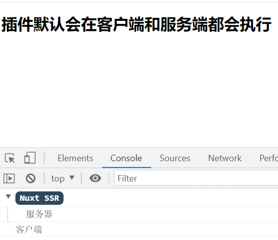
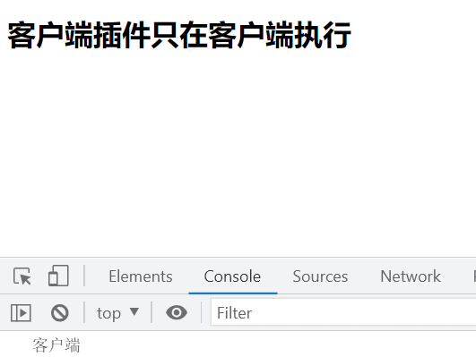
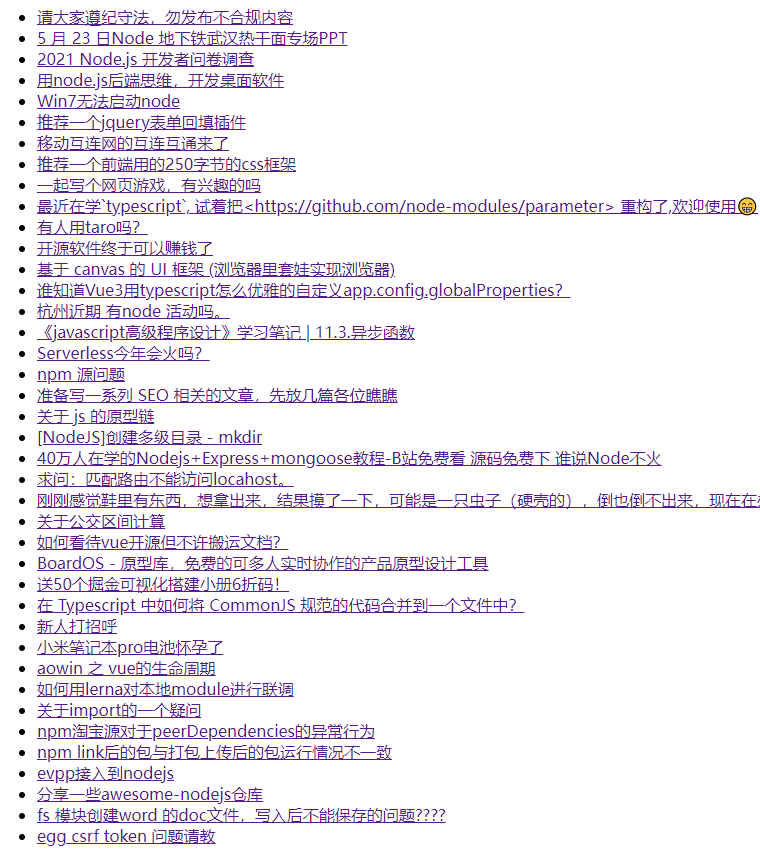
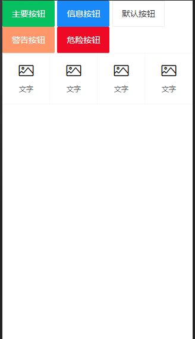

# 插件

## 1.定义

- 插件就是一个```js```文件，这个文件会在每次刷新页面时都会在服务器和客户端执行一遍。

## 2.用途

- 当我们需要使用一些第三方的库时(```ElementUI,Vant, axios```等 )，通过插件来集成到```Vue```中

## 3.插件分类

1. 默认插件，客户端和服务器端都会自动执行
   1. 注入插件: 插件注入后，可以在整个应用程序中都可以使用，典型应用场景是```axios```的封装
   2. ```vue```插件: 插件出入后，可以结合```vue```进行辅助开发， 典型应用场景是```vant，element等ui库```
2. 客户端插件： 只在客户端自动执行的插件
3. 服务端插件： 只在服务端自动执行的插件


## 4.案例演示

**案例演示1-客户端和服务端插件：**

.


实现思路：

1. 创建plugins/xxx.js
2. 在nuxt.config.js 注册该插件
3. 项目启动自动执行插件，打印内容


代码实现：

plugins/test.js

```javascript
export default () => {
    let server = process.server ? '服务器' : '客户端';
    console.log(server);
}
```

nuxt.config.js

```javascript
  plugins: [
    '~/plugins/test'
  ],
```


总结：在plugins目录下创建的插件，在nuxt.config.js注册之后，会自动执行。


**案例演示2-客户端插件：**

..


实现思路：

1. 创建plugins/xxx.js
2. 在nuxt.config.js 注册该插件
3. 项目启动自动执行插件，打印内容


代码实现：

plugins/test.js

```javascript
export default () => {
    let server = process.server ? '服务器' : '客户端';
    console.log(server);
}
```

nuxt.config.js

```javascript
  plugins: [
      {src:'~/plugins/test', mode:'client'}  // 如果只在服务器端渲染只需要把mode：'server'  如果客户端和服务端都执行，设置mode：’both‘
  ],
```


总结： 我们可以通过修改nuxt.config.js配置,来让插件只在某一端执行, 对象写法，mode:指定客户端还是服务端


**案例演示3:· ```-vue插件```**


.


实现思路：

1. 在plugins目录下tooptip.js 插件   文档地址：https://www.npmjs.com/package/v-tooltip
2. 在nuxt.config.js中注册该插件
3. 在页面中当成指令使用v-tooltip=“提示内容”


代码实现：

plugins/tooptip.js

```javascript
import Vue from 'vue'

import tooltip from 'v-tooltip';

Vue.use(tooltip);
```


nuxt.config.js

```javascript
  plugins: [
    '~/plugins/tooltip'
  ],
```


pages/index.vue

```vue
<template>
  <div class="home">
    <h3 v-tooltip="msg">鼠标悬浮显示提示</h3>
  </div>
</template>

<script>
export default {
  data() {
    return {
      msg: "hell Nuxters👏",
    };
  },
};
</script>

<style>
* {
  padding: 0;
  margin: 0;
}
.home {
  width: 400px;
  margin: 100px auto;
}
</style>
```


总结： ```vue插件```，需要在plugins目录中的xxx.js中定义，需要使用```Vue.use```挂载插件，最后在nuxt.config.js注册后，可以在组件中使用


**插件演示4-```axios插件```：**


.


实现思路：

1. 创建plugins/axios.js  注入api
2. 在nuxt.config.js 注册该插件
3. 在页面组件中asyncData中调用


代码实现


plugins/axios.js

```javascript
import axios from 'axios';
export default (context, inject) => {
    axios.defaults.baseURL = 'https://cnodejs.org/api/v1';
    inject('api', {
        getTopics (path) {
            return axios.get(`${path}`);
        }
    });
}
```


pages/index.vue

```vue
<template>
  <div class="home">
    <ul>
      <li v-for="item in topics" :key="item.id"><a href="#">{{ item.title }}</a></li>
    </ul>
  </div>
</template>

<script>
export default {
  async asyncData({ app}) {
    const {
      data: { data: topics },
    } = await app.$api.getTopics("/topics");
    return {
      topics,
    };
  },
};
</script>
```


总结： 使用导出的插件函数第二个参数inject，注入插件后，在nuxt.config.js中注入，在页面中可以使用该插件.


**案例演示5-```vant```**

.


实现思路：

1. 创建plugins/vant.js, 把vant组件挂载到```Vue```上， 要引入对应的vant样式
2. 在nuxt.config.js 注册 该插件
3. 在页面中使用vant提供的组件


代码演示

plugins/vant.js

```javascript
import Vue from 'vue';
// import vant from 'vant';
import {Button,Grid,GridItem} from 'vant';
import 'vant/lib/index.css';
Vue.use(Button);
Vue.use(Grid);
Vue.use(GridItem);
```


```nuxt.config.js```

```javascript
  plugins: [
   '~/plugins/vant'
  ],
```


总结： vant组件需要先挂载到vue上，引入对应样式， 在nuxt.config.js注册后，可以在组件中使用


## 6.总结：

1.  插件就是一个JS文件
2.  这个```js```文件要写在plugins目录
3. 每个JS文件需要在配置文件中注册一下，注册时可以指定只在某一端执行，或者两端都执行
4. 每次刷新页面时插件中都会预先执行
5. 用途：在项目中集成使用自己的库或者第三方库可以使用插件

