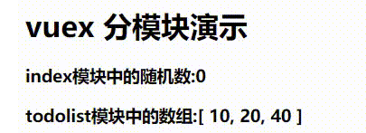
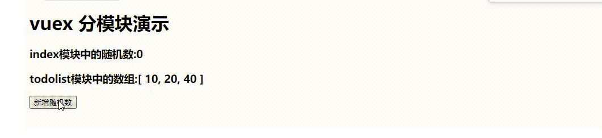

## 1.插件

### 1.目标： 掌握Vue组件库vant使用

### 2.思路

1. yarn  下载```vant```
2. plugins/vant.js  将```vant ```挂载到```vue```实例上  
3. 在nuxt.config.js中注册该插件
4. 在页面中使用

### 3.代码实现

plugins/vant.js

```vue
import Vue from 'vue';
import Vant from 'vant';
import 'vant/lib/index.css';
Vue.use(Vant);
```

pages/index.vue

```vue
<template>
  <div>
    <van-button type="primary">主要按钮</van-button>
    <van-button type="info">信息按钮</van-button>
    <van-button type="default">默认按钮</van-button>
    <van-button type="warning">警告按钮</van-button>
    <van-button type="danger">危险按钮</van-button>
  </div>
</template>

<script>
export default {};
</script>

<style>
</style>
```


### 3.总结

1. plugins/xx.js定义  
2. nuxt.config.js注册
3. 使用UI，注意样式引入


## 2.Vuex

### 1.目标：

​         我们开发中，项目会有很多页面或者组件，页面之间需要共享数据，共享数据就需要放在```vuex```中，集中管理公共数据.

### 2.vuex组成

1. store  存储数据
2. mutations 存放同步修改数据方法
3. actions 存放异步操作方法
4. getters 访问器

### 3.总结

   ```nuxt```内置``vuex``，我们只需要按照```nuxt```中```vuex```创建或者配置规则，就可以直接使用```vuex```


## 3.Vuex基本使用

 vuex需要创建的文件，全部放在store目录下，store目录下的xxx.js 写vuex中state  mutations  actions  getters


#### 1.目标

​     实现计算器


#### 2.实现思路

1. 创建store/index.js 
2. 定义state  mutations  actions
3. 页面中使用store上数据
4. 在page/index.vue 创建两个方法， 完成同步和异步的修改

#### 3.总结

1. nuxt已经内置vuex，我们按照规则在store/index.js  定义好state  mutations actions (导出export)
2. state  必须函数返回一个新对象，避免应用类型数据修改产生的相互影响
3. 在页面中，我们使用this.$store.commit('同步方法'，‘参数’) 完成同步数据修改  
4. 在页面中，我们使用this.$store.dispatch('异步方法'，‘参数’) 完成异步数据修改  
5. 在mutations actions 中定义的方法， 都是参数2接受参数


### 4.vuex中辅助工具

#### 1.目标：

```掌握vuex中mapState  mapMutations  mapActions```


#### 2.思路

1. page/xxx.vue 使用mapState  mapMuations  mapActions
2. nuxt内置vuex， 直接在vuex这个包中导入
3. 在computed:中使用解构mapSate
4. 在method中 解构mapMutations  mapActions


#### 3.总结

1. mapState，mapMutations， mapActions 都是vuex内置的辅助方法

2. mapState，mapMutations， mapActions  三者调用之后都返回一个对象，我们使用解构方式，解构所有属性

   1. ```javascript
       ...mapState(['count'])   === >
           
       {
           count: function () {
               return this.$store.state.count
           }
       }
      
           
      ```

   2. 


## 4.Vuex模块化使用

#### 1.目标

​       我们项目中有很多页面，公共的数据都放在一起，导致数据很臃肿，我们需要对数据根据功能进行拆分多个子模块，优势让vuex数据管理更加清晰。

#### 2.案例

.


#### 3.实现步骤

1. store目录下面创建 index.js  todolist.js文件(自定义)  文件名就是模块名子
2. todolist.js   定义state 存储列表
3. index.js  定义state 存储数字
4. 在页面中分别使用index  todolist中的数据


### 4.总结

1. 页面中使用模块的数据   $store.state.模块名.属性
2. nuxt 会根据store目录下的文件名，来自动帮你根据文件名生成对应的模块
   1. 譬如： store/list.js     ----> list模块    访问时 $store.state.模块名.属性
3. store/index.js是默认， 我们在访问index.js 这个模块中的state时， 无需加模块名，直接访问($store.state.属性)





#### 2.实现思路：

1. 在```page/index.vue```  绑定一个点击事件
2. 在methods里面创建一个方法生成一个0-10的随机数
3. 在```todolist```模块创建一个mutations 完成数据同步修改
4. 在页面中点击事件触发，提交```todolist```模块的mutations 完成集合新增数据

​		


### 3.总结

  1.随机数生成 min -max

1. ```Math.floor(Math.random() * ( max - min + 1 ) + min)```

2.  ```vuex```中各个模块用法一致

3. 除了index模块，  同步修改：``` this.$store.commit(‘模块名/方法名’)```

